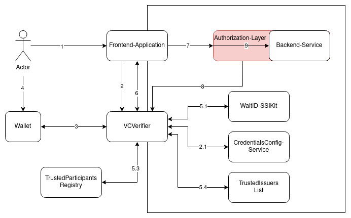
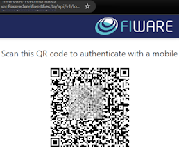
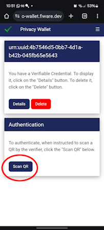

# Verifier
This component is at the center of any interaction taking place in the data space.  
Following the [SIOP-2](https://openid.net/specs/openid-connect-self-issued-v2-1_0.html#name-cross-device-self-issued-op)/[OIDC4VP](https://openid.net/specs/openid-4-verifiable-presentations-1_0.html#request_scope) standards, this component runs a flow to request and present credentials as an extension to the well-established [OpenID Connect](https://openid.net/connect/) protocol. This flow is initiated by a [front-application](frontApplication.md) to grant access to a user to a service (backend-service).  
Its role is similar to the role of an Authorization server in a OAuth2.1 authorization flow. It asks for the credentials, verifies them and emits a token (JWT) used to retrieve afterwards the required informations from the Authorization Layer. 
## H2M Interaction
This diagram shows the steps to grant a user access to a backend-service.

 
Conversation Flow involving the Verifier

The general flow involves the following steps:  
1. An application requests the VCVerifier to retrieve the required info from an user to access a **Service**.
2. The verifier retrieves the set of credencials that the user has to present depending on the Service. This information is provided by the [credentialsConfigService](credentialsConfigService.md)
Depending on the flow the Verifier will ask the user for the required credentials.  
3. The verifier asks the user for these credentials via a QR code.

 
Verifier asking for a set of credentials to the user

4. The user has to provide these credentials. NOTE: These credentials have been previously stored at the user's [Wallet](Wallet.md). See the description of the [VCIssuer](vcIssuer.md)

 
Wallet at the user's mobile showing the button to scan the Verifier QR

5. Once the Verifier has the user's credentials, it performs a multistep verification over them:  
    5.1. At [WaltID-SSIKit](waltID.md) with the configured set of policies.  
    5.4. The issuer is allowed to issuer the credential with the given claims by one of the configured trusted-issuers-list(s). This registry is managed by the [Trusted Issuer List](trustedIssuerList.md) component    
    5.3. The credential is registered in the configured trusted-participants-registries. This registry is managed by the [Trusted Issuer List](trustedIssuerList.md) component
    